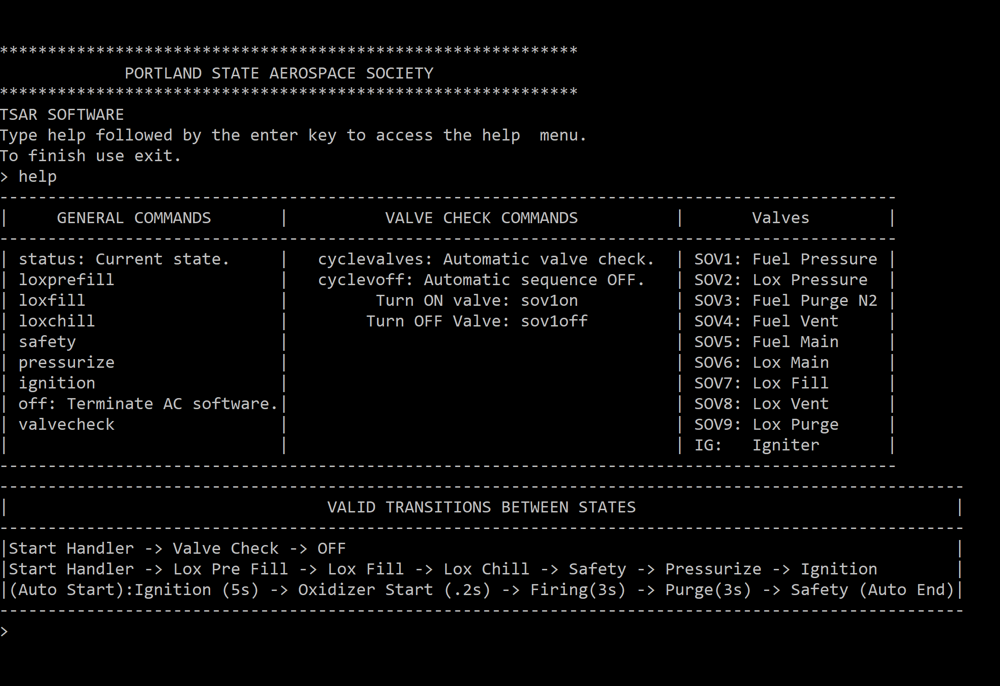

Actuator Controller Test REV 3.0.
- The Beagle Bone AI will communicate with the Nucleo STM32 board via serial over USB. 
- A python script will run in the BB_AI communicating with the Nucleo board allowing the GPIO manipulation of the Nucleo board.

Changes from REV 2.0:
- Added two methods to check the valves 
	- Automatic sequence that turn ON/OFF from SOv1 to IG one by one.
	- Check individual valves.

- Included Python script to drive the AC software from the BB_AI.
- Added communication for different cases between states.
	- Invalid state transition message.
	- If a valve is already ON or alreafy OFF message.
	- Commands only allowed in a certain State message.
	- Retransition to the same state message.
	- Status command to check the current state of the FSM message.
		
Python Script Usage:
   - Use the help command to see that Valves and Igniters used in the python script.
   - Example commands:
        - Turn ON valve SOV1: sov1on
        - Turn OFF valve SOV1: sov1off
        - Terminate the python script: exit
		- Show status of valves/Igniters: status

 GPIO Configuration:
 
 
              
 
 Python script usage:
 
 
 
  
 
