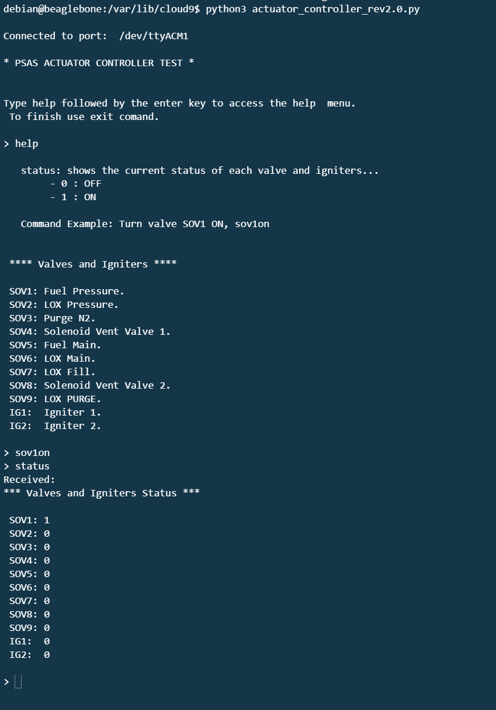

Actuator Controller Test REV 2.0.
- The Beagle Bone AI will communicate with the Nucleo STM32 board via serial over USB. 
- A python script will run in the BB_AI communicating with the Nucleo board allowing the GPIO manipulation of the Nucleo board.

Python Script Usage:
   - Use the help command to see that Valves and Igniters used in the python script.
   - Example commands:
        - Turn ON valve SOV1: sov1on
        - Turn OFF valve SOV1: sov1off
        - Terminate the python script: exit
		- Show status of valves/Igniters: status

 GPIO Configuration:
 
  
 
 Python script usage:
   
