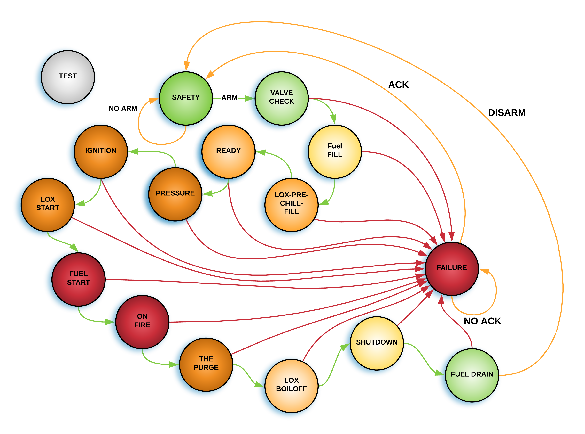

# Actuator Controller Firmware
### Simplified State Diagram

The state configuration above allows the controller to be powered on without risk to technicians working on the test stand setup.  A basic breakdown of each of the states is as follows:

### Safety
This is the initial state when the device is powered up.  In this state all of the solenoids are in their nominal positions and the statemachine can not move until it is explicitly sent a Force Disarm command. This state encomasses several sub-states where technicians will be physically present. It is safe to move out of this safe when the site is clear and there are no humans within 1000 ft of the test stand.

### Pre-Fire
In this state the machine is waiting for the system to pressurize and for the fuel lines to cool.

### Ignition
In this fuel is introduced to the chamber and the igniter is lit.

### Burn Initiated
Things are on fire.

### Burn Termination 1 & 2
Progressively returning to a safe configuration.

### Purge
In this state the system is... tbc
